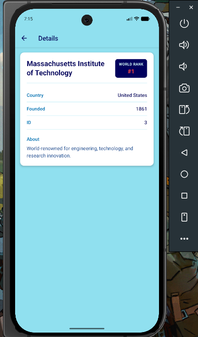
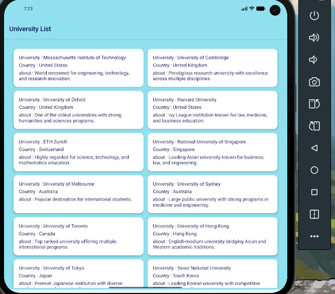
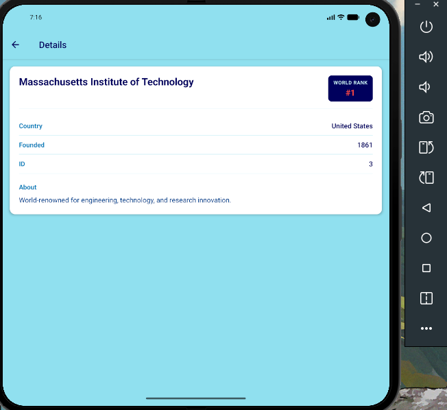

# WayGoodTestApp

A React Native app that displays a browsable list of top universities worldwide. Tap any university to view its details, including world rank, country, founding year, and description.

Built with React Native 0.85, TypeScript, and React Navigation.

## Screenshots

App screenshots are stored in the [`docs/screenshots/`](docs/screenshots/) folder:

| File | Description |
| ---- | ----------- |
| `01-university-list.png` | University list (single column) |
| `02-university-details.png` | University details screen |
| `03-university-list-grid.png` | University list (two-column grid) |
| `04-university-details.png` | University details (alternate view) |

### University List (single column)


### University Details



### University List (two-column grid)

On wider screens (600px+), the list switches to a responsive two-column layout.



### University Details (alternate view)



## Features

- Scrollable university list sorted by world ranking
- Infinite scroll pagination (15 items per page)
- Responsive layout: single column on phones, two columns on tablets/wide screens
- Detail screen with world rank badge, country, founding year, and about section
- Stack navigation between list and detail views

## Prerequisites

Before you begin, complete the [React Native environment setup](https://reactnative.dev/docs/set-up-your-environment) for your target platform (Android and/or iOS).

You will need:

- **Node.js** >= 22.11.0
- **npm** or **Yarn**
- **Android Studio** (for Android) with an emulator or physical device
- **Xcode** (for iOS, macOS only) with CocoaPods

## Setup

1. **Clone the repository**

   ```sh
   git clone <repository-url>
   cd WayGoodTestApp
   ```

2. **Install dependencies**

   ```sh
   npm install
   ```

3. **Install iOS pods** (macOS only, first time or after native dependency changes)

   ```sh
   cd ios
   bundle install
   bundle exec pod install
   cd ..
   ```

## Running the App

1. **Start Metro** (JavaScript bundler)

   ```sh
   npm start
   ```

2. **Run on a device or emulator** (in a separate terminal)

   **Android**

   ```sh
   npm run android
   ```

   **iOS**

   ```sh
   npm run ios
   ```

The app should launch in your Android Emulator, iOS Simulator, or connected device.

## Project Structure

```
WayGoodTestApp/
├── App.tsx                  # Root component and navigation setup
├── src/
│   ├── components/
│   │   └── ListItem.tsx     # University card content
│   ├── navigation/
│   │   └── navs.ts          # Navigation types and route params
│   ├── screens/
│   │   ├── UniListScreen.tsx   # Paginated university list
│   │   └── DetailsScreen.tsx   # University detail view
│   ├── theme/
│   │   └── colors.ts        # App color palette
│   └── utils/
│       └── uniList.js       # University data and pagination helper
└── docs/
    └── screenshots/         # App screenshots for documentation
```

## Tech Stack

- [React Native](https://reactnative.dev) 0.85
- [React Navigation](https://reactnavigation.org) (native stack)
- TypeScript
- React Native Safe Area Context

## Scripts

| Command           | Description                    |
| ----------------- | ------------------------------ |
| `npm start`       | Start the Metro bundler        |
| `npm run android` | Build and run on Android       |
| `npm run ios`     | Build and run on iOS           |
| `npm test`        | Run Jest tests                 |
| `npm run lint`    | Run ESLint                     |

## Troubleshooting

If you run into build or runtime issues, see the official [React Native Troubleshooting guide](https://reactnative.dev/docs/troubleshooting).

Common fixes:

- **Metro cache issues:** `npm start -- --reset-cache`
- **Android build failures:** Clean the project in Android Studio or run `cd android && ./gradlew clean`
- **iOS pod errors:** Delete `ios/Pods` and `ios/Podfile.lock`, then run `bundle exec pod install` again

## Learn More

- [React Native Documentation](https://reactnative.dev/docs/getting-started)
- [React Navigation Documentation](https://reactnavigation.org/docs/getting-started)
